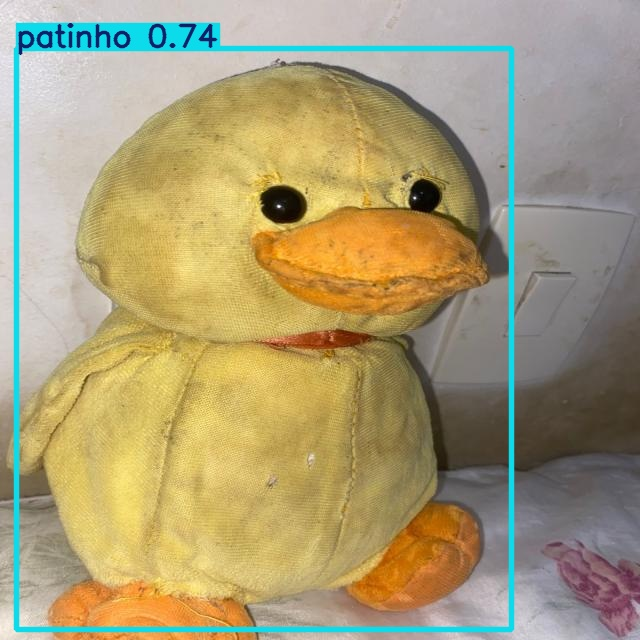
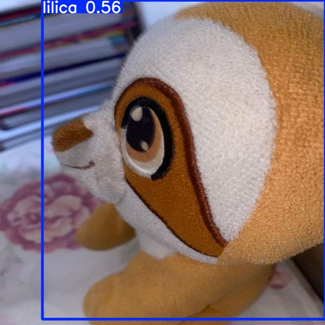
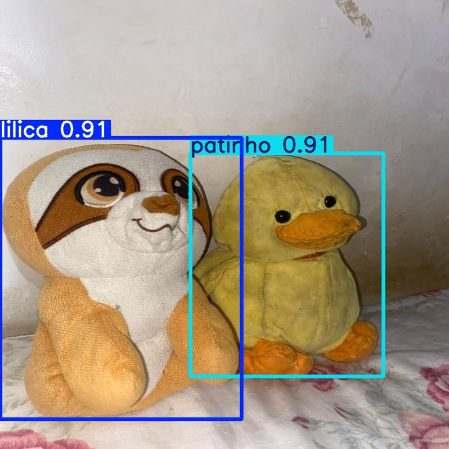

# 🧠 Detecção e Classificação de Imagens com Deep Learning

Este projeto utiliza **Deep Learning** para detectar e classificar duas classes de objetos:  
- 🦆 **Patinho de pelúcia**  
- 🦥 **Preguiça de pelúcia ("Lilica")**

---

## 📂 Dataset

O dataset foi construído a partir de **89 imagens originais**, processadas e divididas em três conjuntos:

- **Treino:**  
  - 50 imagens originais  
  - +100 imagens criadas via *Data Augmentation* (cisalhamento, rotação e inversão)  
  - **Localização:** `yolov3/dataset/train`

- **Validação:**  
  - 25 imagens  
  - **Localização:** `yolov3/dataset/valid`

- **Teste:**  
  - 14 imagens  
  - **Localização:** `yolov3/dataset/test`

---

## 🏗 Arquitetura e Ambiente

- **Rede Neural:** [YOLOv3](https://pjreddie.com/darknet/yolo/) implementada em **PyTorch**
- **Hardware:** GPU NVIDIA GeForce RTX 3050 (4GB)
- **Linguagem:** Python 3.10
- **Dependências:** descritas em [`yolov3/requirements.txt`](yolov3/requirements.txt)

---

## 📊 Resultados

Após **50 épocas de treinamento**, a rede apresentou **alta precisão e recall** para ambas as classes.

| Classe   | Precision (P) | Recall (R) | mAP@.50 | mAP@.50-.95 |
|---------|---------------|-----------|--------|-------------|
| **all**     | 0.965         | 1.000     | 0.995  | 0.810 |
| **lilica**  | 0.934         | 1.000     | 0.995  | 0.842 |
| **patinho** | 0.996         | 1.000     | 0.995  | 0.777 |

---

## 📤 Exportação e Resultados

- **Pesos do treinamento:**  
  `yolov3/runs/train/PatinhoLilica_YOLOv37/`

- **Imagens resultantes da fase de teste:**  
  `yolov3/runs/detect/exp4/`

---

## 🖼 Exemplos de Detecção

A seguir, alguns exemplos de inferência do modelo no conjunto de teste:

  
  

